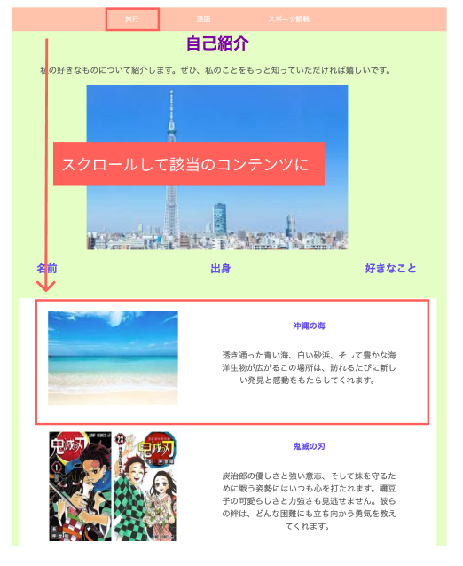
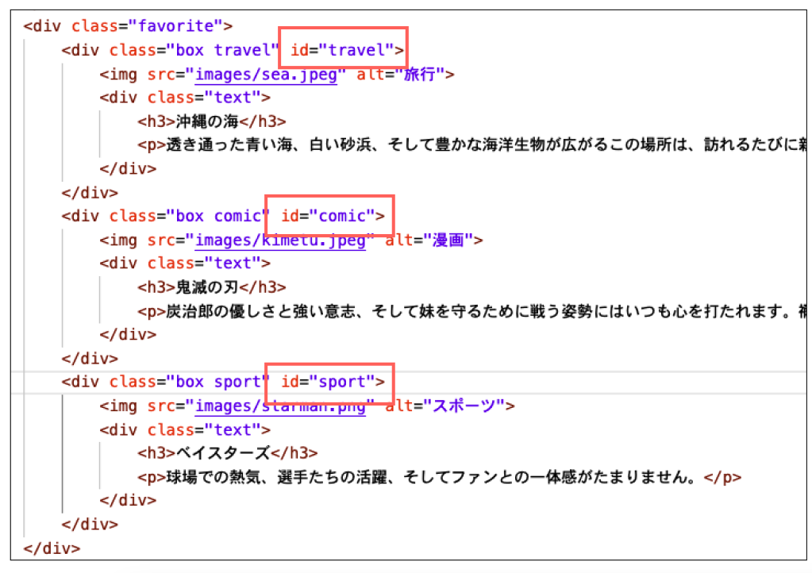
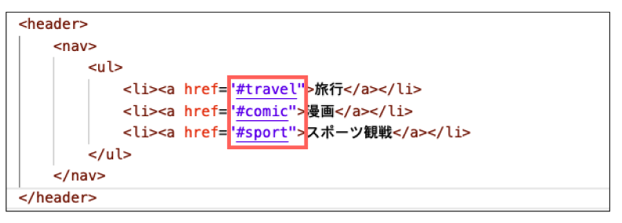
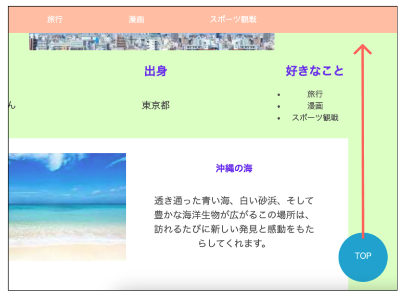

# **ページ内リンク**

## **この単元でやること**

1. ページ内リンクの仕組み
2. TOPに戻るボタン

### **1. ページ内リンクの仕組み**



リンクさせたい要素にid名をつける



`<a href="#id名"`　hrefに#id名とする




```html

    <nav>
        <ul>
            <li><a href="#travel">旅行</a></li>
            <li><a href="#comic">漫画</a></li>
            <li><a href="#sport">スポーツ観戦</a></li>
        </ul>
    </nav>

    <!-- 省略 -->

    <div class="favorite">
        <div class="box travel" id="travel">
            
            <div class="text">
                <h3>沖縄の海</h3>
                <p>透き通った青い海、白い砂浜、そして豊かな海洋生物が広がるこの場所は、訪れるたびに新しい発見と感動をもたらしてくれます。</p>
            </div>
        </div>
        <div class="box comic" id="comic">
            
            <div class="text">
                <h3>鬼滅の刃</h3>
                <p>炭治郎の優しさと強い意志、そして妹を守るために戦う姿勢にはいつも心を打たれます。禰豆子の可愛らしさと力強さも見逃せません。彼らの絆は、どんな困難にも立ち向かう勇気を教えてくれます。</p>
            </div>
        </div>
        <div class="box sport" id="sport">
            
            <div class="text">
                <h3>ベイスターズ</h3>
                <p>球場での熱気、選手たちの活躍、そしてファンとの一体感がたまりません。</p>
            </div>
        </div>
    </div>

```

### **idってなに？**  

ページ内でその名前を持つ要素が１つだけ特定されるもの  
`１つの要素を特定して、その要素を操作したい場合によく使われます`  

- 1つのページ内でid名は`同じ名前を複数つけることはできない`

### **スムーススクロール**

リンクをクリックすると指定の要素に瞬時にジャンプして少し混乱しますね・・・  
ゆっくりスクロールするにはcssに`scroll-behavior: smooth;`を追加しよう

```css

html {
    scroll-behavior: smooth;
}

```

### **2. TOPに戻るボタン**

`<a href="#">TOP</a>`

```html

<a href="#"><div class="modoru">TOP</div></a>

```

```css

.modoru {
    width: 100px;
    height: 100px;
    padding-top: 35px;
    text-align: center;
    border-radius: 50%;
    background-color: #0bd;
    color: #fff;
    position: fixed;
    bottom: 20px;
    right: 20px;
}

```


