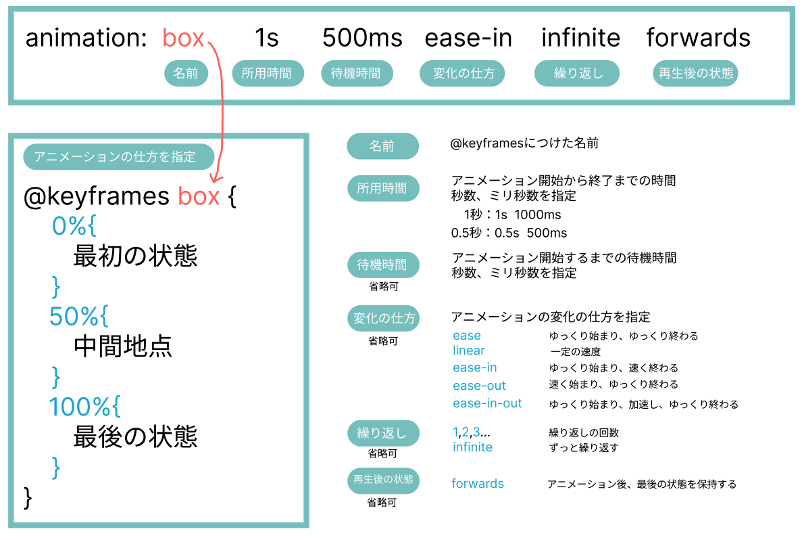
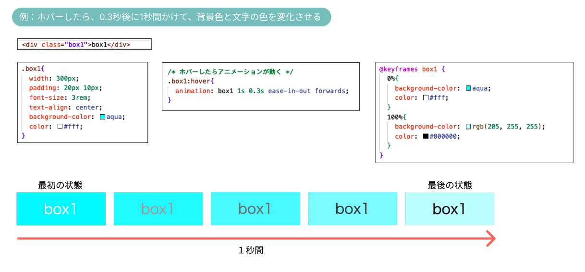
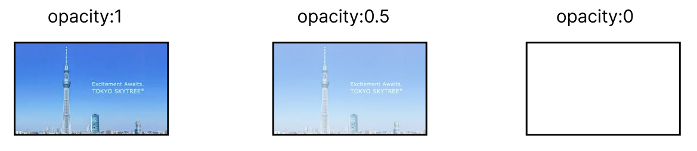
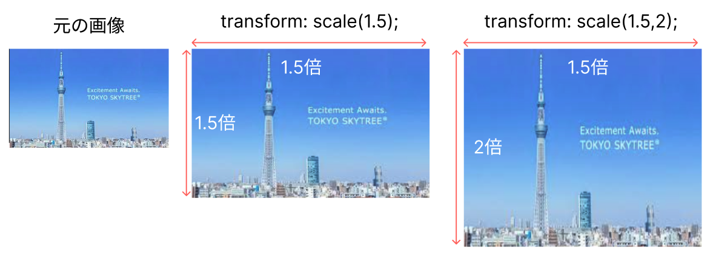
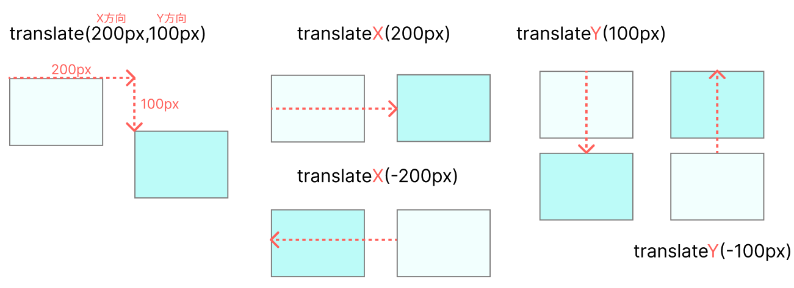

# **animation**

## **この単元でやること**

1. animationの基礎（色を変える）
2. 透明にする　opacity
3. 拡大 transform scale
4. 移動 transform transrate

デモサイト  
https://programing-course.github.io/website/animation/animation.html

### **1. animationの基礎（色を変える）**






### **2. 透明度**

```css

opacity:0.5;

```



### **3. 拡大**

```css

transform:scale(1.5);

```



### **4. 移動**

```css

transform:translate(200px,100px);
transform:translateX(200px);
transform:translateY(200px);

```

