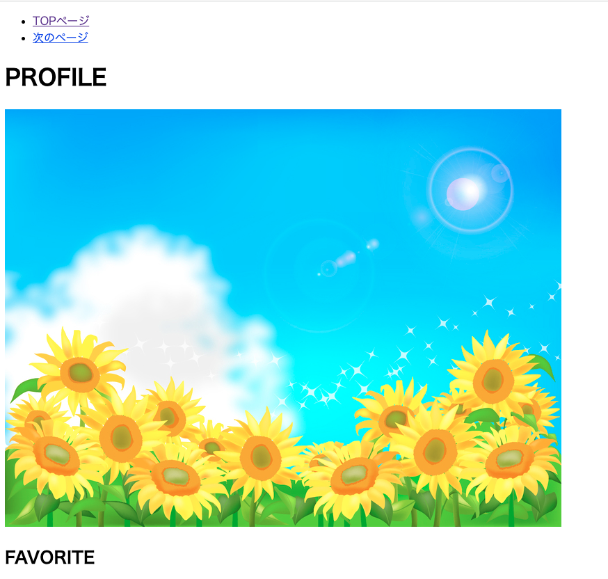
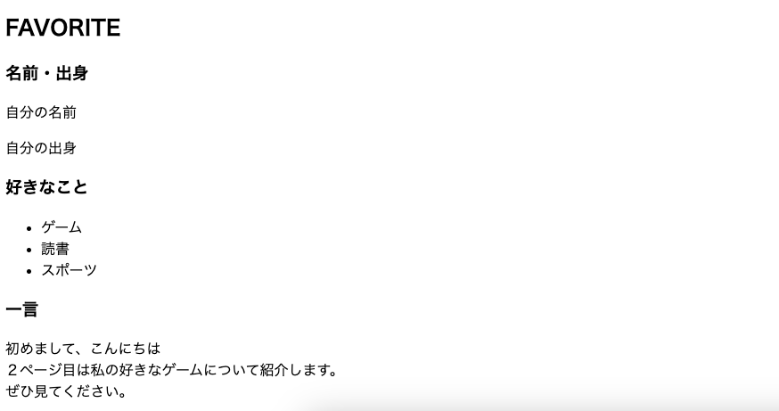

# **Webサイト制作（基礎）復習**

## **HTMLを復習しよう**

HTML、CSSを復習する課題です。実践の授業に入る前に復習したい人は授業外でやってみよう。  
一人で進めるのが難しい人は、マンツーマン授業を使うことができます。

### **1. 環境を作る**

#### **課題① 下記のフォルダ構成でフォルダとファイルを作りましょう**

- デスクトップ > 「プログラミング復習」 > 「images」  
- 「プログラミング復習」 > 「index.html」
- 「プログラミング復習」 > 「style.css」

### **2. htmlのコードを書いてみよう（index.html）**

**わからないコードはgoogle検索やchatGPTなどを使って調べよう**

**①基本構造**

``` html

<!DOCTYPE html>
<html lang="ja">
    <head>
        <meta charset="UTF-8">
        <title>自己紹介</title>
    </head>
    <body>
        
    </body>
</html>

```

**②グループを作る**

``` html

    <body>
        <header>

        </header>
        <div class="wrapper">

        </div>
    </body>

```

**③ナビゲーションを作る**

``` html

    <header>
        <nav>
            <ul>
                <li>
                    <a href="index.html">TOPページ</a>
                </li>
                <li>
                    <a href="next_page.html">次のページ</a>
                </li>
            </ul>
        </nav>
    </header>

```

**④メイン見出しと画像を表示**

画像を表示します。好きな画像を使って表示しよう。  
画像を「images」フォルダに入れて、リンクさせます。


```html

    <header>
        <nav>
            <ul>
                <li>
                    <a href="index.html">TOPページ</a>
                </li>
                <li>
                    <a href="next_page.html">次のページ</a>
                </li>
            </ul>
        </nav>
        <!-- ここ追加 -->
        <h1>PROFILE</h1>
        <div class="main_visual">
            
        </div>
    </header>

```

**⑤メインの中を作る（見出し）**


```html

    <div class="wrapper">
        <h2>FAVORITE</h2>
    </div>

```

ここまでの表示



**⑥メインの中を作る（記事グループ）**

```html

    <div class="wrapper">
        <h2>FAVORITE</h2>
        <!-- ここ追加 -->
        <div class="container">
            <div class="content">
                <h3>名前・出身</h3>
            </div>
            <div class="content">
                <h3>好きなこと</h3>
            </div>
            <div class="content">
                <h3>一言</h3>
            </div>
        </div>
    </div>

```

**⑦メインの中を作る（文字と箇条書き）**

```html

    <div class="container">
        <div class="content">
            <h3>名前・出身</h3>
            <!-- ここ追加 -->
            <p>自分の名前</p>
            <p>自分の出身</p>
        </div>
        <div class="content">
            <h3>好きなこと</h3>
            <!-- ここ追加 -->
            <ul>
                <li>ゲーム</li>
                <li>読書</li>
                <li>スポーツ</li>
            </ul>
        </div>
        <div class="content">
            <h3>一言</h3>
            <!-- ここ追加 -->
            <p>
                初めまして、こんにちは<br>
                ２ページ目は私の好きなゲームについて紹介します。<br>
                ぜひ見てください。
            </p>
        </div>
    </div>

```
ここまでの表示




### **htmlコード**

```html

<!DOCTYPE html>
<html lang="ja">
    <head>
        <meta charset="UTF-8">
        <title>自己紹介</title>
    </head>
    <body>
        <header>
            <nav>
                <ul>
                    <li>
                        <a href="index.html">TOPページ</a>
                    </li>
                    <li>
                        <a href="next_page.html">次のページ</a>
                    </li>
                </ul>
            </nav>
        </header>
        <div class="wrapper">
            <h1>PROFILE</h1>
            <div class="main_visual">
                
            </div>
            <h2>FAVORITE</h2>
            <!--  -->
            <div class="container">
                <div class="content">
                    <h3>名前・出身</h3>
                    <p>自分の名前</p>
                    <p>自分の出身</p>
                </div>
                <div class="content">
                    <h3>好きなこと</h3>
                    <ul>
                        <li>ゲーム</li>
                        <li>読書</li>
                        <li>スポーツ</li>
                    </ul>
                </div>
                <div class="content">
                    <h3>一言</h3>
                    <p>
                        初めまして、こんにちは<br>
                        ２ページ目は私の好きなゲームについて紹介します。<br>
                        ぜひ見てください。
                    </p>
                </div>
            </div>
        </div>
    </body>
</html>

```