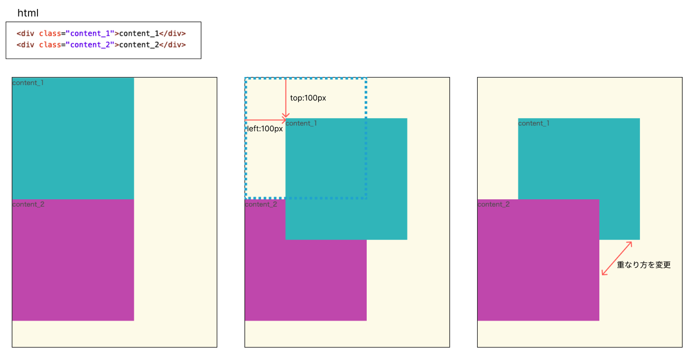
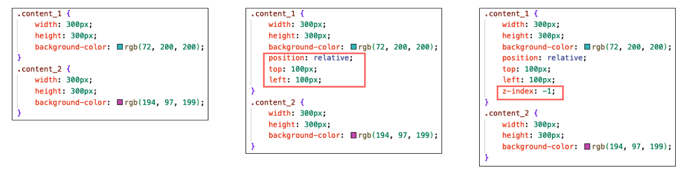
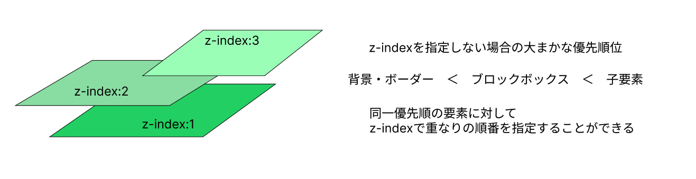
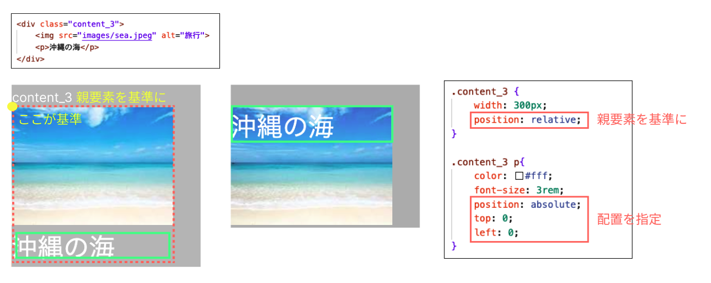
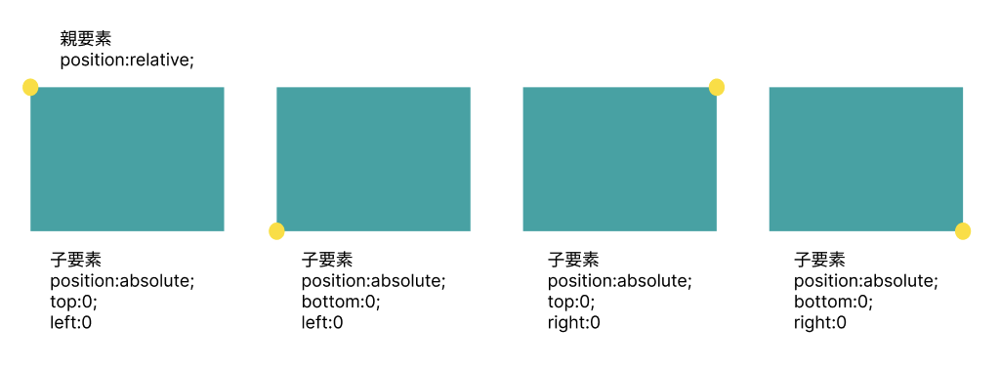
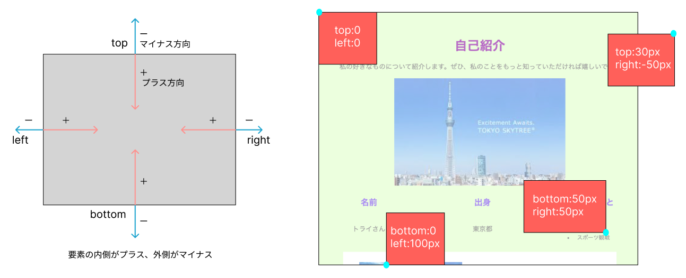
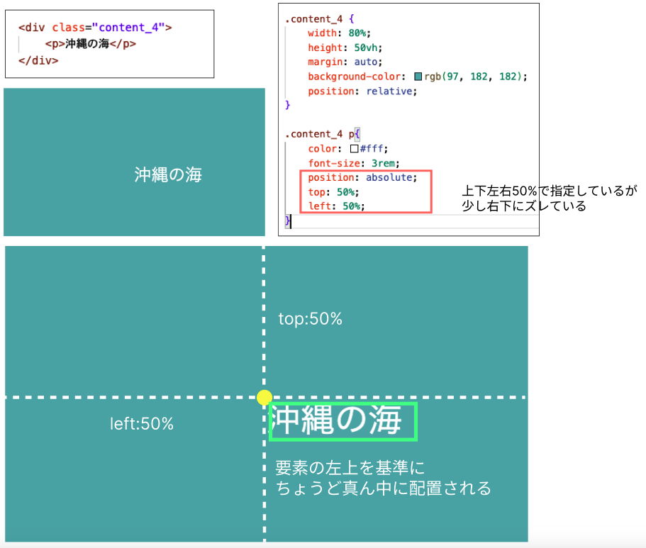
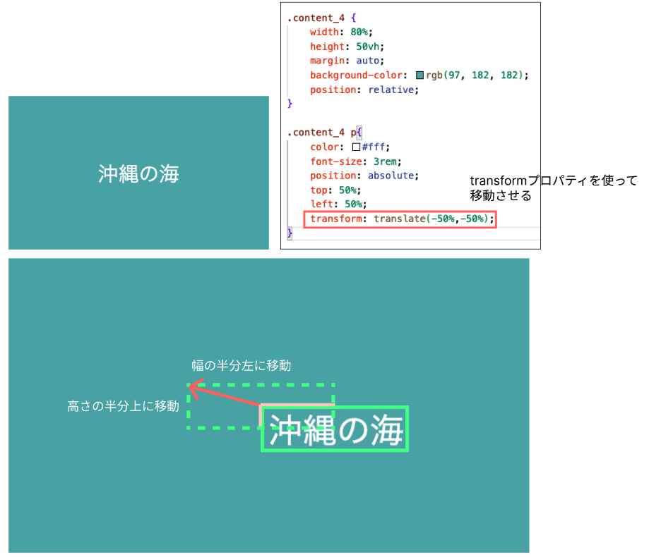

# **配置の指定（要素を重ねる）**

## **この単元でやること**

1. 相対位置を指定
2. 要素の真ん中に配置

### **1. 相対位置を指定**

**①元いた場所を基準に配置を指定**  
**`position:relative`**  

**`z-index`とは**  

- positionプロパティとセットで使用できる（positionを指定していなとz-indexは適用されない）
- マイナス値も設定可能（z-index:-1;）
- 固定のナビゲーションなど、常に一番手前に表示したい場合は大きい数値を指定（z-index:999;）

 

**②親要素を基準に配置を指定**  
**`position:relative` と `absolute`セットで使う**

- 親要素に`position:relative;`を指定
- 配置の基準地は　top　bottom　left　right　で指定  
- 位置の指定は px　%　で指定

### **2. 要素の真ん中に配置（％で指定）**

