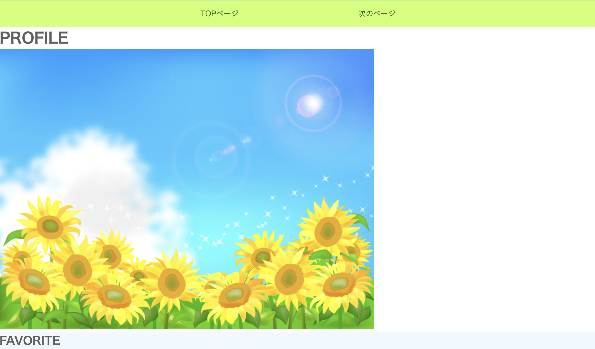
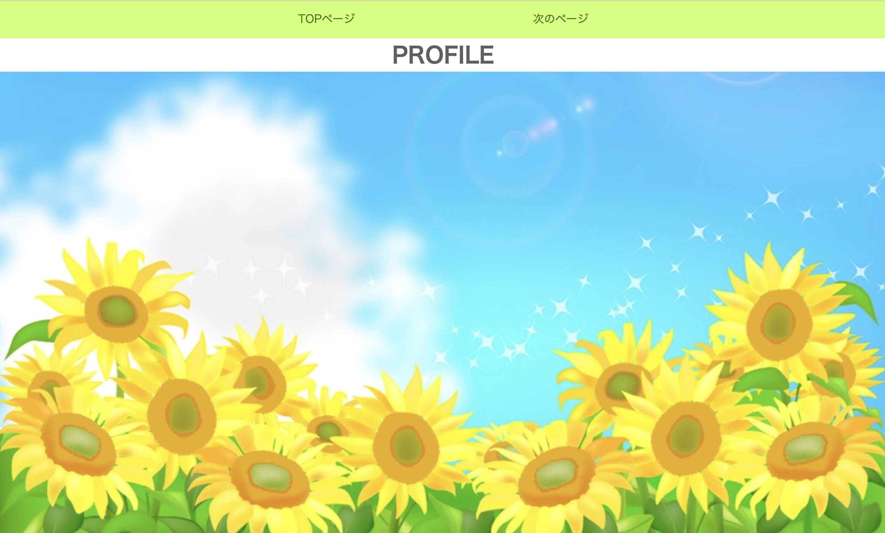
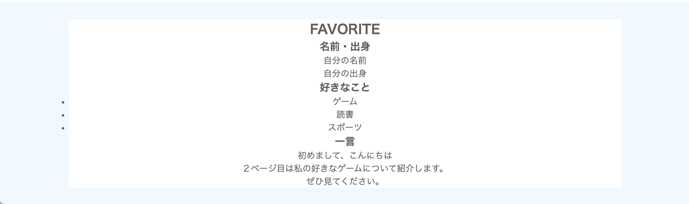
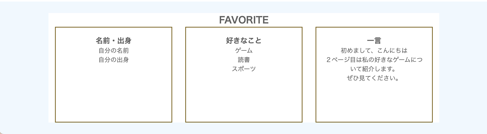
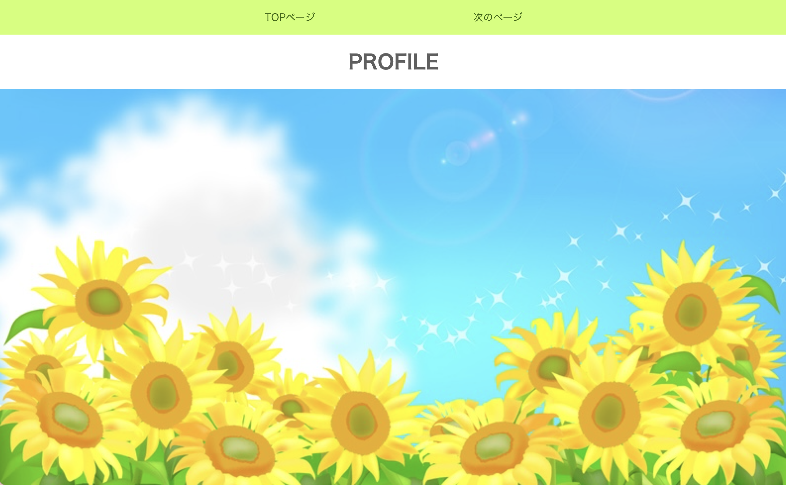
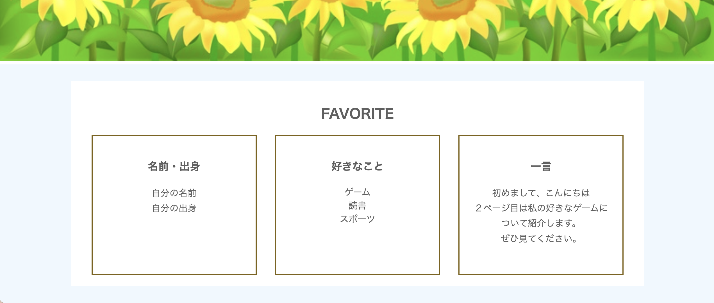

# **Webサイト制作（基礎）復習**

## **CSSを復習しよう**

HTMLを復習しようの続きです

### **1. cssのコードを書いてみよう**

**わからないコードはgoogle検索やchatGPTなどを使って調べよう**

**①リンク（index.html）**

style.cssとリセットCSSをリンクする

``` html

<!DOCTYPE html>
<html lang="ja">
    <head>
        <meta charset="UTF-8">
        <title>自己紹介</title>
        <!-- ここ追加 -->
        <link rel="stylesheet" href="https://unpkg.com/ress/dist/ress.min.css">
        <link rel="stylesheet" href="style.css">
    </head>
</html>

```

**②全体の背景色を設定**

``` css

@charset "UTF-8";

body{
    background-color: aliceblue;
    color: rgb(95, 95, 95);
}

```

**③ヘッダーナビゲーションの装飾**

``` css

header{
    background-color: rgb(255, 255, 255);
}

nav{
    background-color: rgb(206, 255, 109);
}

nav ul {
    display: flex;
    justify-content: center;
}

nav ul li {
    padding: 1rem 4rem;
    list-style: none;
}

nav ul li a {
    color: rgb(56, 105, 1);
    text-decoration: none;
    padding: 1rem 4rem;
}

```

ここまでの表示



**④メイン見出しと画像の装飾**


```css

h1{
    text-align: center;
}

.main_visual img{
    width: 100%;
}


```



**⑤メインの余白**


```css

.wrapper{
    width: 80%;
    margin: 30px auto;
    padding:20px;
    background-color: rgb(255, 255, 255);
    text-align: center;
}

```




**⑥メインの記事を横並びと装飾**

```css

.container {
    display: flex;
    justify-content: space-around;
}

.content {
    width: 30%;
    height: 250px;
    border: solid 2px #7e6311;
    padding:20px;
}

.content ul li {
    list-style: none;
}

```



**⑦細かい余白**

```css

h1,h2,h3{
    margin: 20px 0;
}

p{
    line-height: 1.7;
}

```




### **cssコード（全体）**

```css

@charset "UTF-8";

body{
    background-color: aliceblue;
    color: rgb(95, 95, 95);
}

header{
    background-color: rgb(255, 255, 255);
}

nav{
    background-color: rgb(206, 255, 109);
}

nav ul {
    display: flex;
    justify-content: center;
}

nav ul li {
    padding: 1rem 4rem;
    list-style: none;
}

nav ul li a {
    color: rgb(56, 105, 1);
    text-decoration: none;
    padding: 1rem 4rem;
}

h1{
    text-align: center;
}

.main_visual img{
    width: 100%;
}

.wrapper{
    width: 80%;
    margin: 30px auto;
    padding:20px;
    background-color: rgb(255, 255, 255);
    text-align: center;
}

.container {
    display: flex;
    justify-content: space-around;
    
}

.content {
    width: 30%;
    height: 250px;
    border: solid 2px #7e6311;
    padding:20px;
}

.content ul li {
    list-style: none;
}

h1,h2,h3{
    margin: 20px 0;
}

p{
    line-height: 1.7;
}


```