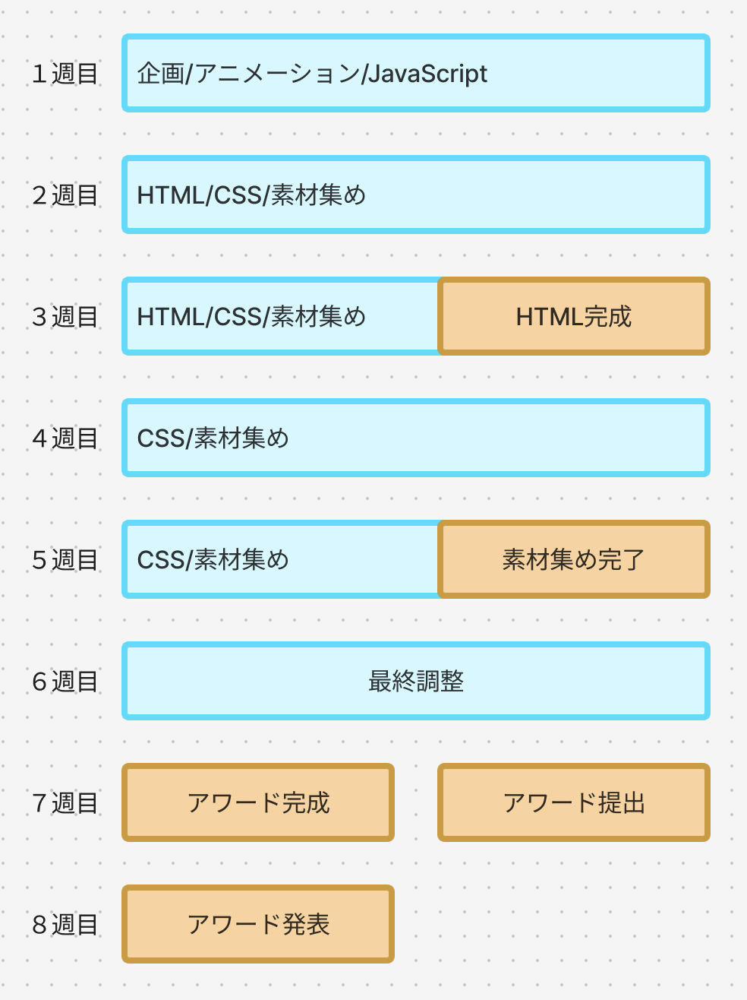

# **Webアワードの企画**

## **この単元でやること**

1. スケジュールの確認
2. テーマ・ターゲット決め
3. サイトマップ
4. ワイヤーフレーム
5. コンテンツ決め
6. 素材集め

### **1. スケジュールの確認**

いつまでになにをしたらよいか確認しよう！！  

**企画の流れ**

### **2. サイトのテーマ・ターゲット決め**

- どんなHPを作りたいか、イメージしてみよう
- figjamを使って、考えをまとめたり書き出したりしてみよう
- テーマが決まったらどんな情報を書けばいいか考えよう

### **3. サイトマップ**

- 共通部分を作成するには、まず、そのサイトが何ページで構成されているかを決めておくと後の修正が少なくて済みます
- 企画を立てた後は、サイトを構成する見出しを箇条書きし、簡単なディレクションマップを作ってみましょう

- figjamを使う  

### **4. ワイヤーフレーム**

- 何ページ必要か考えついたら、どんなレイアウトで情報を配置するか考えてみよう  
- figmaにおおよそのレイアウトを入れていってみよう  
- どこにどの情報を配置するか、細かく決めておくと後のコーディングが楽です

### **5. コンテンツ決め**

- 内容を考える
- サイトを見た人にどんな効果を与えるか、何を伝えたいか、自分だから伝えられること（経験・体験など）を書き出してみよう
  
### **6. 素材集め**

- 自分が作りたいサイトにイメージが近い画像を探してみよう！
- フリー素材を活用するもよし、自分でイラストを描く、友達に頼んで書いてもらう、などなるべく早い段階であたりを付けておくと、後が楽です  

- Canvaでロゴを作る
- 画像を加工する
- 写真を撮る
- インタビューする
