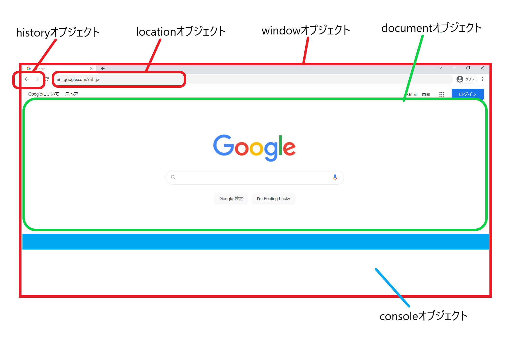

# **JavaScript基礎**

## **この単元でやること**

1. JavaScript/jQueryとは

### **1. JavaScriptとは**

JavaScriptはブラウザを操作するためのプログラミング言語  

**ブラウザを操作するって？**

**JavaScriptの例**

リアルタイムにコンテンツを入れ替えたり、動きをつけることができます。

 - 「戻る」ボタンを押したら`前の画面に戻る`
 - 「登録」ボタンを押したら`アラートダイアログが表示される`
 - `HTMLの中の文字を書き換える`
 - `CSSの値を書き換える`
 - `リアルタイムに計算した結果を表示する`
 - `コンソールに表示する`
 - `スクロールの位置を検知`

 

### **2. JavaScriptを動かしてみよう**

下のサイトにアクセスして、実際に動かしてみよう！  

https://programing-course.github.io/website/javascript/

### **3. jQueryとは**

JavaScript を簡単に書けるようにするためのライブラリ  
ライブラリ（Library） とは、特定の機能をまとめたプログラムの集まりのこと

### **4. jQueryを動かしてみよう**

下のサイトにアクセスして、実際に動かしてみよう！  

https://programing-course.github.io/website/jQuery/
