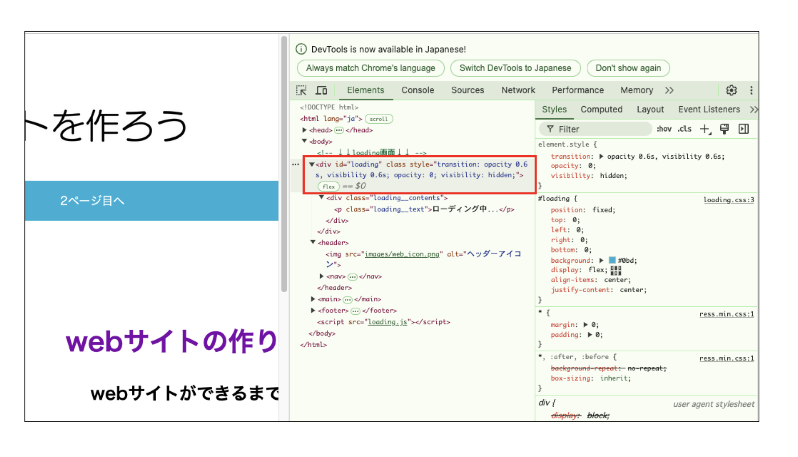

# **ローディングを使ってみよう**

## **この単元でやること**

1. 文字のローディング
2. 画像のローディング
3. カウントアップのローディング

<br><br>

サンプルを見てみよう

https://programing-course.github.io/website/loading_slider/

<br>

１〜３から好きなものを選んで追加してみよう

<br><br>

### **0.準備**

- `Web基礎コース`を`受講した`方  
    Web基礎コースで使用した、「サイトの作り方」のプログラムを使用してください。  
    [1. 文字のローディング]へ進んでください。
    <br>

- `受講していない`方  
    下記の課題を進めてください。


#### **ベースのプログラムをダウンロード**

- [02_JavaScript] > [演習プログラム] > [サイトの作り方.zip]をダウンロード
- デスクトップに「`プログラミング`」フォルダ、その中に「`サイトの作り方.zip`」を展開する

<br><br>

### **1. 文字のローディング**


### **①ローディング用のスクリーンを作る**

`<body>`のすぐ下にいれておく

**【index.html】**

```html

<body>
　<div id="loading">
    <div class="loading__contents">
      <p class="loading__text">ローディング中...</p>
    </div>
  </div>

```

**【style.css】**

```css

#loading {
  position: fixed;
  left: 0;
  top: 0;
  width: 100%;
  height: 100%;
  z-index: 999;
  background:#0bd;
  display: flex;
  align-items: center;
  justify-content: center;
}

.loading__contents {
  text-align: center;
}

.loading__text {
  font-size: 32px;
  font-weight: 700;
  color: #ffff;
}

```

`position:fixed`でスクリーンを画面の上に固定

**要素の固定の仕方**  
詳しくは  `00_html_css応用 > 20_要素の配置（固定）.md`を参照してみよう

<br>

### **②動きをつける**

**JavaScriptファイルをつくる**

**script.jsファイルを新規作成し、htmlにリンクする**

**【index.html】**

```html
        <!--省略-->
        <script src="script.js"></script>
    </body>
</html>

```

**【script.js】**

```js

//ローディング画面の処理
window.addEventListener('DOMContentLoaded', function () {
  const loadingElement = document.getElementById('loading');

  // ローディング画面を非表示にする関数
  function hideLoading() {
    loadingElement.style.transition = 'opacity .6s ease, visibility .6s ease';
    loadingElement.style.opacity = 0;
    loadingElement.style.visibility = 'hidden';
  }
  setTimeout(function () {
    hideLoading();
  }, 3000);
}
);

```
<br>

1. `id="loading"`が指定されている要素を取得
2. setTimeoutで3000m秒（3秒）間かけてhideLoading()の部分を実行する
3. hideLoading()関数でやっていること
   1. opacity（透明度）を0.6秒かけて0（透明）にする
   2. visibility（表示非表示）を0.6秒かけてhidden（非表示）にする

<br>

**JavaScriptからcssのプロパティを操作している**


<br><br>

### **2. 画像のローディング**

画像ファイルを「サイトの作り方」> 「images」フォルダに入れる
- [02_JavaScript] > [演習画像] > [loading_slider_img.zip]をダウンロード

### **①ローディング用のスクリーンを作る**

`<boey>`のすぐ下にいれておく

**【index.html】**

```html
<body>
    <div id="loading">
        <div id="loading__img">
            
        </div>
    </div>

```

**【style.css】**

```css

/*fixedで全面に固定*/
#loading {
    position: fixed;
    left: 0;
    top: 0;
    width: 100%;
    height: 100%;
    z-index: 999;
    background: #333;
}

```

`position:fixed`でスクリーンを画面の上に固定  

詳しくは  `00_html_css応用 > 20_要素の配置（固定）.md`を参照してみよう

```css

/* Loading画像中央配置　*/
#loading__img {
    position: absolute;
    top: 50%;
    left: 50%;
    transform: translate(-50%, -50%);
}

/* Loading アイコンの大きさ設定　*/
#loading__img img {
    width: 260px;
}

```

画像をスクリーンの真ん中に表示する 

詳しくは
- `00_html_css応用` > `22_要素の配置（重ねる）.md` > `2. 要素の真ん中に配置（％で指定）`  
- `00_html_css応用` > `23_アニメーション（透明・移動・拡大）.md` > `4.移動`


<br>

```css

/* fadeUpをするアイコンの動き */
.fadeUp {
    animation-name: fadeUpAnime;
    animation-duration: 0.5s;
    animation-fill-mode: forwards;
    opacity: 0;
}

@keyframes fadeUpAnime {
    from {
        opacity: 0;
        transform: translateY(100px);
    }

    to {
        opacity: 1;
        transform: translateY(0);
    }
}

```

画像を`animation`を使って、0.5秒間で透明度を0から1に変化  
表示位置を下から上に移動

詳しくは  `00_html_css応用 > 23_アニメーション（透明・移動・拡大）.md`を参照してみよう


### **②動きをつける**

**JavaScriptファイルをつくる**

**script.jsファイルを新規作成し、htmlにリンクする**

jQueryを使ったローディング画面をつくる場合

```html

    <!--省略-->

    <script src="https://code.jquery.com/jquery-3.4.1.min.js" integrity="sha256-CSXorXvZcTkaix6Yvo6HppcZGetbYMGWSFlBw8HfCJo=" crossorigin="anonymous"></script>
    <script src="script.js"></script>
</body>

```

**【script.js】**

```js

window.addEventListener('DOMContentLoaded', function () {
  //ローディング画面を1.5秒（1500ms）待機してからフェードアウト
  $("#loading").delay(1500).fadeOut('slow');
  //ロゴを1.2秒（1200ms）待機してからフェードアウト
  $("#loading__img").delay(1500).fadeOut('slow');
});

```

1.5秒たったら`fadeOut`を使って画像とスクリーンを消す

<br><br>

### **3. カウントアップのローディング**

### **プラグインを使ってみよう！**

プラグインとは  
「jQueryの機能を使って、サイトのパーツや動作を簡単に追加・カスタマイズできるあらかじめ作られたプログラム」

企業や個人の開発者が作成してプログラムを公開しています。

### **プラグインの基本的な使い方**


### **progressbar（プログレスバー）プラグインを使ってみよう**

【公式サイト（英語）】https://ja.wordpress.org/plugins/progress-bar-wp/  

[proguressbar ローディング]などで検索して、日本語のサイトを探すと良いです

<br><br>


### **①必要なファイルをリンク**

jQuery  
JavaScript

```html

<!--省略-->

    <script src="https://code.jquery.com/jquery-3.4.1.min.js" integrity="sha256-CSXorXvZcTkaix6Yvo6HppcZGetbYMGWSFlBw8HfCJo=" crossorigin="anonymous"></script>
    <script src="https://rawgit.com/kimmobrunfeldt/progressbar.js/master/dist/progressbar.min.js"></script>
    
    <script src="script.js"></script>
</body>

```

### **②コードをコピー**

`<body>`のすぐ下にいれておく

**【index.html】**


```html

<body>
    <div id="loading">
        <div id="loading__text"></div>
    </div>

```

**【style.css】**

```css

#loading {
    position: fixed;
	width: 100%;
	height: 100%;
	z-index: 999;
	background:#333;
	text-align:center;
	color:#fff;
}

```

**【script.js】**


```js

    //テキストのカウントアップの設定
var bar = new ProgressBar.Line(loading__text, {//id名を指定
	strokeWidth: 0,//進捗ゲージの太さ
	duration: 1000,//時間指定(1000＝1秒)
	trailWidth: 0,//線の太さ
	text: {//テキストの形状を直接指定	
		style: {//天地中央に配置
			position:'absolute',
			left:'50%',
			top:'50%',
			padding:'0',
			margin:'0',
			transform:'translate(-50%,-50%)',
			'font-size':'1.2rem',
			color:'#fff',
		},
		autoStyleContainer: false //自動付与のスタイルを切る
	},
	step: function(state, bar) {
		bar.setText(Math.round(bar.value() * 100) + ' %'); //テキストの数値
	}
});

//アニメーションスタート
bar.animate(1.0, function () {//バーを描画する割合を指定します 1.0 なら100%まで描画します
	$("#loading").delay(500).fadeOut(800);//アニメーションが終わったら#splashエリアをフェードアウト
});  

```
