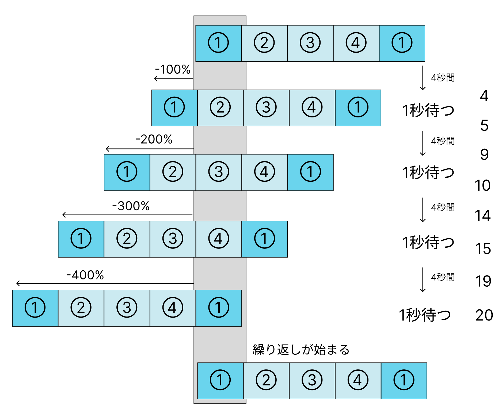

# **スライダーを使ってみよう**

## **この単元でやること**

1. プラグインを使わないスライダー
2. slickプラグインを使ったスライダー

<br><br>

サンプルを見てみよう

https://programing-course.github.io/website/loading_slider/

<br><br>

### **1. CSSのみで作るスライダー**

- `ul`の最後に最初の画像の`li`をダミーで追加しておく
- 画像ファイルを「サイトの作り方」> 「images」フォルダに入れる
- [02_JavaScript] > [演習画像] > [loading_slider_img.zip]をダウンロード

```html

    <ul class="slider">
        <li></li>
        <li></li>
        <li></li>
        <li></li>
        <li></li>
    </ul>

```

```css

.slider {
    width: 320px;
    height: 250px;
    display: flex;
    border: solid 3px #ddd;
    overflow: hidden;   /* はみ出た部分は表示しない */
    margin: 0 auto;
    margin-top: 20px;   /* 水平方向中央寄せ */
}

/* カルーセル内の画像 */
.slider img {
    width: 320px;   /* .sliderのwidthに合わせる */
    height: 250px;   /* .sliderのheightに合わせる */
    margin: 0;
    padding: 0;
    display: block;
}

.slider li {
    list-style: none;
}


/* スクロールアニメーションのキーフレーム */
@keyframes scroll {

    /* 初期位置は1個目の画像が左端 0秒*/
    0% {
        margin-left: 0;
    }

    /* 1個分左の位置に進めて2個目の画像を左端にする 4*/
    20% {
        margin-left: -100%;
    }

    /* 少しの間上と同じ位置 5*/
    25% {
        margin-left: -100%;
    }

    /* 2個分左の位置に進めて3個目の画像を左端にする 9*/
    45% {
        margin-left: -200%;
    }

    /* 少しの間上と同じ位置 10*/
    50% {
        margin-left: -200%;
    }

    /* 3個分左の位置に進めて3個目の画像を左端にする 11*/
    70% {
        margin-left: -300%;
    }

    /* 少しの間上と同じ位置 15*/
    75% {
        margin-left: -300%;
    }

    /* 4個分左の位置に進めて3個目の画像を左端にする 16*/
    95% {
        margin-left: -400%;
    }

    /* 少しの間上と同じ位置 20*/
    100% {
        margin-left: -400%;
    }
}

/* カルーセルの子要素にスクロールアニメーションを設定 */
.slider> :first-child {
    animation-name: scroll;
    /* キーフレーム名 */
    animation-duration: 20s;
    /* 再生時間全体は20秒 */
    animation-delay: 0s;
    /* 読込直後から遅延無しで開始 */
    animation-iteration-count: infinite;
    /* 無限に繰り返す */
}

```



アニメーションについて詳しくは
- `00_html_css応用` > `23_アニメーション（透明・移動・拡大）.md` > `4.移動`


<br><br>

### **2. プラグインを使用したスライダー**

### **slickスライダープラグインを使ってみよう**

【公式サイト】https://kenwheeler.github.io/slick/  
【参考サイト】https://and-ha.com/coding/slick/

### **準備**  

- 画像ファイルを「サイトの作り方」> 「images」フォルダに入れる
- [02_JavaScript] > [演習画像] > [loading_slider_img.zip]をダウンロード

### **①必要なファイルをリンク**

css  
jQuery  
JavaScript

**【next_page.html】**

```html
<head>
    <meta charset="UTF-8">
    <title>Webサイトをつくろう</title>
    <!--CSS-->
    <link rel="stylesheet" href="https://unpkg.com/ress/dist/ress.min.css">
    <link rel="stylesheet" href="style.css">
</head>

<!--省略-->

    <!--jQuery-->
    <script src="https://code.jquery.com/jquery-3.4.1.min.js" integrity="sha256-CSXorXvZcTkaix6Yvo6HppcZGetbYMGWSFlBw8HfCJo=" crossorigin="anonymous"></script>
    <!--slick用js-->
    <script src="https://rawgit.com/kimmobrunfeldt/progressbar.js/master/dist/progressbar.min.js"></script>

    
    <script src="script.js"></script>
</body>

```

### **②コードをコピー**

**【next_page.html】**

```html

<main>
        <ul class="slider">
            <li></li>
            <li></li>
            <li></li>
            <li></li>
            <li></li>
        </ul>
    </main>

```

**【style.css】**

```css

.slider {/*横幅80%で左右に余白を持たせて中央寄せ*/
    width:80%;
    margin: auto;
    margin-top: 10vw;
}

.slider img {
    width:30vw;/*スライダー内の画像を30vwにしてレスポンシブ化*/
    height:auto;
}

.slider .slick-slide {
    transform: scale(0.8);/*左右の画像のサイズを80%に*/
    transition: all .5s;/*拡大や透過のアニメーションを0.5秒で行う*/
    opacity: 0.5;/*透過50%*/
}

.slider .slick-slide.slick-center{
    transform: scale(1);/*中央の画像のサイズだけ等倍に*/
    opacity: 1;/*透過なし*/
}


/*矢印の設定*/

/*戻る、次へ矢印の位置*/
.slick-prev, 
.slick-next {
    position: absolute;/*絶対配置にする*/
    top: 42%;
    cursor: pointer;/*マウスカーソルを指マークに*/
    outline: none;/*クリックをしたら出てくる枠線を消す*/
    border-top: 2px solid #666;/*矢印の色*/
    border-right: 2px solid #666;/*矢印の色*/
    height: 15px;
    width: 15px;
}

.slick-prev {/*戻る矢印の位置と形状*/
    left: -1.5%;
    transform: rotate(-135deg);
}

.slick-next {/*次へ矢印の位置と形状*/
    right: -1.5%;
    transform: rotate(45deg);
}

/*ドットナビゲーションの設定*/

.slick-dots {
    text-align:center;
    margin:20px 0 0 0;
}

.slick-dots li {
    display:inline-block;
    margin:0 5px;
}

.slick-dots button {
    color: transparent;
    outline: none;
    width:8px;/*ドットボタンのサイズ*/
    height:8px;/*ドットボタンのサイズ*/
    display:block;
    border-radius:50%;
    background:#ccc;/*ドットボタンの色*/
}

.slick-dots .slick-active button{
    background:#333;/*ドットボタンの現在地表示の色*/
}

```

**【script.js】**

```js

$('.slider').slick({
    autoplay: true,//自動的に動き出すか。初期値はfalse。
    infinite: true,//スライドをループさせるかどうか。初期値はtrue。
    speed: 500,//スライドのスピード。初期値は300。
    slidesToShow: 3,//スライドを画面に3枚見せる
    slidesToScroll: 1,//1回のスクロールで1枚の写真を移動して見せる
    prevArrow: '<div class="slick-prev"></div>',//矢印部分PreviewのHTMLを変更
    nextArrow: '<div class="slick-next"></div>',//矢印部分NextのHTMLを変更
    centerMode: true,//要素を中央ぞろえにする
    variableWidth: true,//幅の違う画像の高さを揃えて表示
    dots: true,//下部ドットナビゲーションの表示
});

```